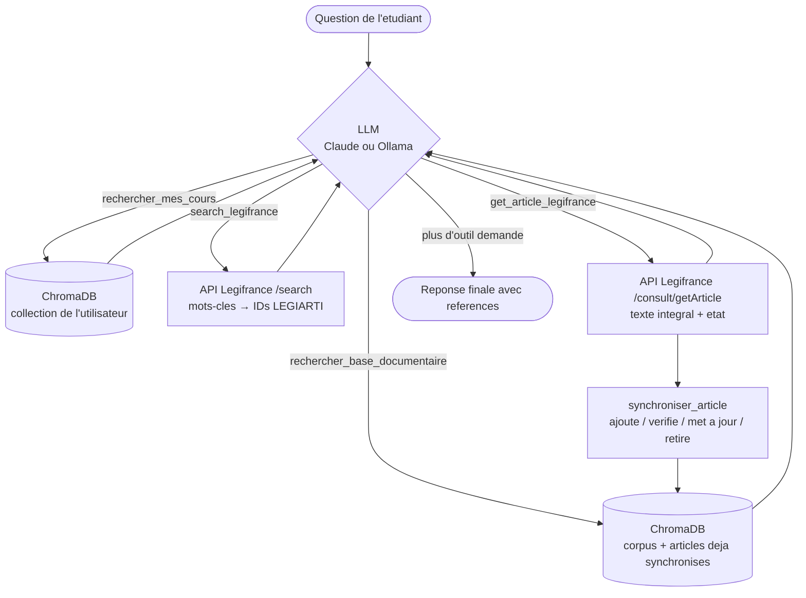

# jurIA

Assistant juridique conversationnel specialise en droit francais, concu pour aider un proche en etudes de droit a comprendre des concepts juridiques, retrouver des articles de loi et preparer ses travaux universitaires.

## Fonctionnalites

- **Agent juridique avec outils** : le LLM decide lui-meme quand chercher, ou chercher (base locale, documents de l'etudiant, Legifrance) et quand il en sait assez pour repondre.
- **RAG (Retrieval-Augmented Generation)** : recherche semantique dans une base documentaire vectorielle (ChromaDB + embeddings Solon) avant de repondre.
- **Fallback Legifrance** : si la base locale ne suffit pas, l'agent interroge en temps reel l'API officielle Legifrance (PISTE), recupere le texte integral de l'article et verifie qu'il est toujours en vigueur.
- **Base auto-enrichissante** : chaque article lu sur Legifrance est synchronise dans ChromaDB. La question suivante sur le meme sujet est servie localement ; les articles verifies il y a plus de 180 jours sont re-verifies avant d'etre cites.
- **Etapes de recherche visibles** : chaque recherche s'affiche au-dessus de la reponse avec une icone animee pendant l'execution (« Recherche Legifrance : « contrat de travail » »), puis se replie en un resume cliquable (articles trouves, liens, sources).
- **Double backend LLM** : Claude (Anthropic) en production ou petite config, Ollama (modele local) en developpement — bascule automatique via variables d'environnement.
- **Historique des conversations** : persistance SQLite des threads et messages, reprise de conversation depuis la barre laterale.
- **Authentification** : login par mot de passe (bcrypt) en production ; profil developpeur automatique en mode dev.
- **Starters pre-configures** : questions d'exemple cliquables (responsabilite contractuelle, dol/erreur, prescription penale).

## Comment l'agent repond a une question

Quand l'etudiant envoie un message, jurIA ne repond pas directement : il fait tourner une **boucle de tool calling** (`juria/chat.py`). A chaque tour, le LLM recoit l'historique, le prompt systeme et la liste des outils ; soit il demande un ou plusieurs outils, soit il produit sa reponse finale.



### Pas a pas

1. **Reception** (`app.py`, `on_message`) : le message est ajoute a l'historique de session, puis `stream_response()` lance la boucle. Le message de reponse n'est envoye qu'a la fin, pour que les etapes de recherche s'affichent au-dessus.
2. **Base locale d'abord** : le prompt systeme (`juria/prompts.py`) impose de commencer par `rechercher_base_documentaire`. La requete est encodee avec Solon, ChromaDB renvoie les 5 passages les plus proches et seuls ceux sous le seuil de distance cosinus (0.3) sont gardes.
3. **Evaluation des resultats** (`formater_contexte`, `juria/rag/query_engine.py`) :
   - aucun passage pertinent → le LLM recoit `AUCUN_RESULTAT_PERTINENT`, ce qui declenche le fallback ;
   - un article Legifrance synchronise il y a plus de `FRAICHEUR_JOURS` (180 j) est marque `[A_REVERIFIER]` → le LLM doit le relire sur Legifrance avant de le citer.
4. **Fallback Legifrance** : le LLM reformule la question en 2 a 4 mots-cles juridiques et appelle `search_legifrance` (au plus 3 tentatives avec des mots-cles differents). Il recoit au plus 10 articles : ID `LEGIARTI...`, code, numero et extrait.
5. **Lecture et verification** : avant de citer un article, le LLM appelle `get_article_legifrance` pour obtenir le texte integral et son etat (`VIGUEUR`, abroge...). Un article qui n'est plus en vigueur est signale explicitement.
6. **Auto-enrichissement** : l'article lu est synchronise dans ChromaDB (voir tableau ci-dessous). La prochaine question similaire est donc servie par la base locale, sans appel reseau.
7. **Reponse** : quand le LLM ne demande plus d'outil, sa reponse est envoyee. Regle du prompt : ne jamais citer un article qui n'a pas ete obtenu via un outil.

### Les outils

Declares deux fois dans `juria/prompts.py` (format Anthropic et format OpenAI/Ollama), executes dans `_executer_outil()` (`juria/chat.py`).

| Outil | Parametres | Source | Etape affichee |
|---|---|---|---|
| `rechercher_base_documentaire` | `requete`, `domaine` (optionnel) | ChromaDB, collection principale | « Base documentaire : N source(s) pour « ... » » |
| `rechercher_mes_cours` | `requete` | ChromaDB, collection de l'utilisateur | « Vos documents : N passage(s) pour « ... » » |
| `search_legifrance` | `mots_cles`, `nom_code` (optionnel) | API PISTE `/search` | « Legifrance : N article(s) pour « ... » » |
| `get_article_legifrance` | `article_id`, `nom_code` (optionnel) | API PISTE `/consult/getArticle` | « Article 1242 du Code civil (en vigueur) » |

### Synchronisation des articles Legifrance (`juria/ingestion/legifrance_sync.py`)

| Cas | Action dans ChromaDB | Statut |
|---|---|---|
| Article en vigueur, absent de la base | Embedding + upsert | `ajoute` |
| Article en vigueur, texte identique | Upsert (met a jour `date_verification`) | `verifie` |
| Article en vigueur, texte modifie | Nouvel embedding + upsert | `mis_a_jour` |
| Article abroge / modifie, present dans la base | Suppression | `retire` |
| Article abroge / modifie, absent | Rien | `ignore` |

Metadonnees stockees : `legi_id`, `code`, `num`, `url`, `etat`, `source_type="legifrance"`, `date_ajout`, `date_verification`.

### Exemple

```
Etudiant : « Que dit le Code civil sur la responsabilite du fait des choses ? »

1. rechercher_base_documentaire("responsabilite du fait des choses")  → AUCUN_RESULTAT_PERTINENT
2. search_legifrance("responsabilite fait des choses", nom_code="Code civil")
   → LEGIARTI000051786000 (art. 1242), LEGIARTI000032042331 (art. 1355)
3. get_article_legifrance("LEGIARTI000051786000")  → texte integral, VIGUEUR, sync : ajoute
4. Reponse avec le texte exact de l'article 1242 et son lien Legifrance
5. Meme question plus tard → l'article 1242 est trouve directement en base locale
```

### Robustesse

- **Erreurs API** : une erreur Legifrance (500, timeout...) est loguee en warning ; le LLM recoit « aucun article trouve » ou un message d'erreur et continue sa reponse sans planter.
- **Token OAuth2** : mis en cache, renouvele 60 s avant expiration, un seul retry automatique sur 401.
- **Appels bloquants** : les recherches ChromaDB et l'encodage Solon sont synchrones ; ils passent par `cl.make_async` pour ne pas geler l'interface.

## Stack technique

| Composant | Choix | Detail |
|---|---|---|
| Interface chat | [Chainlit](https://chainlit.io) 2.11 | UI conversationnelle, historique, etapes (`cl.Step`) |
| LLM production | [Claude](https://anthropic.com) (claude-sonnet-4-6) | Via le SDK `anthropic` (AsyncAnthropic) |
| LLM developpement | [Ollama](https://ollama.com) (Mistral par defaut) | Via le SDK `openai` pointant sur l'API locale Ollama |
| Textes de loi | [API Legifrance](https://piste.gouv.fr) (PISTE, DILA) | OAuth2 client credentials, `httpx` asynchrone |
| Embeddings | [Solon](https://huggingface.co/OrdalieTech/Solon-embeddings-large-0.1) | Modele francais 1024 dimensions |
| Base vectorielle | [ChromaDB](https://www.trychroma.com/) | Stockage et recherche par similarite cosinus |
| Persistance | SQLite + aiosqlite | Base `data/juria_app.db` pour threads, steps, users |
| Authentification | bcrypt | Hachage des mots de passe, stockage en SQLite |

## Arborescence

```
jurIA/
├── app.py                          # Point d'entree Chainlit : data layer, auth, starters, handlers
│
├── juria/                          # Package metier
│   ├── chat.py                     # Backend LLM, boucle de tool calling, execution des outils
│   ├── prompts.py                  # Prompt systeme (strategie de recherche) et outils (Anthropic + OpenAI)
│   ├── auth.py                     # Authentification : bcrypt, gestion users SQLite, mode dev
│   ├── user_docs.py                # Upload et indexation de documents utilisateur
│   ├── config.py                   # Embeddings, parametres RAG (top_k, seuil, fraicheur, chunking)
│   ├── ingestion/
│   │   ├── legifrance_client.py    # Client API PISTE : OAuth2, search, getArticle
│   │   ├── legifrance_sync.py      # Synchronisation des articles Legifrance dans ChromaDB
│   │   ├── chunking.py             # Decoupage hierarchique des textes de loi
│   │   └── build_index.py          # Script d'indexation de PDF dans ChromaDB
│   └── rag/
│       ├── vector_store.py         # Interface ChromaDB (collection principale + par utilisateur)
│       ├── query_engine.py         # Encodage requete, recherche, formatage du contexte
│       └── callbacks.py            # Formatage des sources affichees dans les etapes
│
├── public/
│   ├── juria.css                   # Style des etapes de recherche (icone animee, chevron)
│   └── idea.svg                    # Icone des starters
│
├── scripts/
│   └── create_user.py              # CLI pour creer un compte utilisateur
│
├── data/
│   ├── juria_app.db                # Base SQLite (threads, steps, users)
│   ├── vectorstore/                # Collections ChromaDB (gitignored)
│   ├── raw/                        # Corpus brut telecharge (gitignored)
│   └── user_docs/                  # Documents uploades par utilisateur
│
├── .chainlit/
│   └── config.toml                 # Configuration Chainlit (UI, cot = "tool_call", custom_css)
├── .env.example                    # Template des variables d'environnement
├── CHANGELOG_LEGIFRANCE_FALLBACK.md # Detail de l'implementation du fallback Legifrance
├── requirements.txt                # Dependances Python
└── chainlit.md                     # Message d'accueil affiche dans l'UI
```

## Installation

```bash
python -m venv .venv
source .venv/bin/activate  # Linux/Mac
# .venv\Scripts\activate   # Windows

pip install -r requirements.txt
```

## Configuration

Copier `.env.example` en `.env` et renseigner les valeurs :

```bash
cp .env.example .env
```

| Variable | Description | Requis |
|---|---|---|
| `JURIA_ENV` | `dev` (Ollama local) ou `prod` (Claude API) | Non (defaut : `dev`) |
| `JURIA_PETITE_CONFIG` | `true` pour utiliser Claude meme en dev (si une cle API est presente) ; sinon modele Ollama allege | Non (defaut : `false`) |
| `ANTHROPIC_API_KEY` | Cle API Anthropic | Oui en prod |
| `CHAINLIT_AUTH_SECRET` | Secret pour les sessions Chainlit | Oui en prod |
| `OLLAMA_MODEL` | Modele Ollama a utiliser | Non (defaut : `mistral`) |
| `OLLAMA_BASE_URL` | URL de l'API Ollama | Non (defaut : `http://localhost:11434/v1`) |
| `LEGIFRANCE_CLIENT_ID` | Identifiant de l'application PISTE | Oui pour le fallback Legifrance |
| `LEGIFRANCE_CLIENT_SECRET` | Secret de l'application PISTE | Oui pour le fallback Legifrance |
| `PISTE_OAUTH_URL` | URL OAuth PISTE | Non (defaut : sandbox) |
| `PISTE_API_BASE` | URL de base de l'API Legifrance | Non (defaut : sandbox) |

Sans identifiants Legifrance, les outils `search_legifrance` / `get_article_legifrance` renvoient simplement aucun resultat : l'agent fonctionne avec la base locale seule.

### Obtenir un acces Legifrance

1. Creer un compte sur [piste.gouv.fr](https://piste.gouv.fr) et une application.
2. Souscrire a l'API « Legifrance » et accepter ses CGU.
3. Reporter l'identifiant et le secret OAuth de l'application dans `.env`.

Par defaut, jurIA utilise la **sandbox** PISTE. Pour passer en production :

```
PISTE_OAUTH_URL=https://oauth.piste.gouv.fr/api/oauth/token
PISTE_API_BASE=https://api.piste.gouv.fr/dila/legifrance/lf-engine-app
```

## Lancement

### Mode developpement (Ollama)

Prerequis : [Ollama](https://ollama.com) installe et lance avec un modele disponible (`ollama pull mistral`).

```bash
chainlit run app.py -w
```

L'application demarre sur `http://localhost:8000` avec un profil developpeur automatique (pas de login requis).

### Mode production (Claude)

```bash
JURIA_ENV=prod chainlit run app.py
```

Un ecran de login s'affiche. Creer un utilisateur au prealable :

```bash
python scripts/create_user.py --username alice --password motdepasse --display-name "Alice D."
```

### Indexer un corpus

```bash
python -m juria.ingestion.build_index --pdf chemin/vers/document.pdf --domaine procedure_fiscale
```

> Le premier appel qui touche ChromaDB charge le modele Solon (~2 Go) : la premiere recherche apres un demarrage peut prendre plusieurs dizaines de secondes sur CPU.

## Architecture

### Selection du backend LLM (`juria/chat.py`)

- **Prod** (`JURIA_ENV=prod`) : `AsyncAnthropic` avec claude-sonnet-4-6.
- **Dev + petite config avec cle API** : Claude egalement, pour eviter un modele local trop lourd pour la machine.
- **Dev** : `AsyncOpenAI` pointe sur Ollama, modele configurable via `OLLAMA_MODEL`. Les modeles sans tool calling ignorent les outils et repondent directement.

Les deux backends partagent la meme boucle : appel non streame pour detecter les tool calls, execution des outils, renvoi des resultats, jusqu'a la reponse finale.

### Client Legifrance (`juria/ingestion/legifrance_client.py`)

- **`search(mots_cles, nom_code=None)`** : recherche dans le fond `CODE_DATE`, filtree sur la version en vigueur a la date du jour (`DATE_VERSION` + `singleDate`) et eventuellement sur un code (`NOM_CODE`). Essaie `TOUS_LES_MOTS_DANS_UN_CHAMP` puis `UN_DES_MOTS`. Chaque resultat de l'API est un code ; les articles sont extraits de `sections[].extracts[]`.
- **`get_article(article_id)`** : texte integral (HTML nettoye), etat, numero, URL publique.

> Attention : l'API PISTE repond **500** (et non 400) quand le corps de la requete est invalide, par exemple `DATE_VERSION` avec une valeur texte au lieu d'un timestamp. Un 500 sur `/search` n'indique donc pas forcement une panne du serveur.

### Affichage des etapes (`.chainlit/config.toml`, `public/juria.css`)

`cot = "tool_call"` affiche les `cl.Step` de type `tool`. Chaque etape porte une icone Lucide (`scale`, `book-open`, `library`, `file-text`) ; `juria.css` l'anime tant que l'etape tourne, masque le prefixe « Utilise / Utilisé » de Chainlit et transforme le chevron en `›`. Le CSS cible le DOM de Chainlit 2.11 : a reverifier en cas de mise a jour majeure.

### RAG (`juria/rag/`)

- **vector_store.py** : collection principale (corpus juridique + articles Legifrance synchronises) et une collection par utilisateur (documents uploades).
- **query_engine.py** : encode la requete avec Solon, interroge ChromaDB, filtre par seuil de distance cosinus (0.3), formate le contexte (marqueurs `AUCUN_RESULTAT_PERTINENT` et `[A_REVERIFIER]`).
- **callbacks.py** : liste des sources consultees (avec pertinence et lien Legifrance), affichee dans l'etape depliee.

### Ingestion (`juria/ingestion/`)

- **chunking.py** : decoupage hierarchique des textes de loi en chunks avec metadonnees (source, chapitre, section, article).
- **build_index.py** : script d'indexation qui encode les chunks et les insere dans ChromaDB.

### Authentification (`juria/auth.py`)

- **Mode dev** (`JURIA_ENV=dev`) : un `header_auth_callback` retourne automatiquement un utilisateur `dev`, sans ecran de login.
- **Mode prod** : `password_auth_callback` avec verification bcrypt contre la table `users` en SQLite.

### Persistance (`app.py`)

Le `SQLAlchemyDataLayer` de Chainlit est configure avec SQLite (`data/juria_app.db`). Les tables (`users`, `threads`, `steps`, `elements`, `feedbacks`) sont creees automatiquement au demarrage. A la reprise d'une conversation, seuls les messages texte (utilisateur et assistant) sont recharges dans l'historique envoye au LLM, pas les resultats d'outils.

## Statut du projet

- [x] Interface conversationnelle Chainlit
- [x] Tool calling (Anthropic + OpenAI/Ollama)
- [x] RAG : base vectorielle ChromaDB + embeddings Solon
- [x] Recherche dans la base documentaire avec affichage des sources
- [x] Fallback temps reel sur l'API Legifrance (recherche + lecture d'article)
- [x] Synchronisation automatique des articles Legifrance dans ChromaDB et controle de fraicheur
- [x] Etapes de recherche animees et repliables
- [x] Authentification par mot de passe (prod) / auto-login (dev)
- [x] Persistance de l'historique des conversations (SQLite)
- [x] Reprise de conversation depuis la sidebar
- [x] Pipeline d'ingestion et chunking hierarchique
- [x] Starters pre-configures
- [ ] Upload de documents dans le chat : `handle_upload` (`juria/user_docs.py`) existe mais n'est pas encore appele depuis `on_message`
- [ ] Tests unitaires (`tests/` contient des fichiers vides)
- [ ] Passage de la sandbox PISTE a la production
- [ ] Deploiement (Railway / Render)
- [ ] CI/CD (GitHub Actions : `ci.yml` et `deploy.yml` sont vides)
